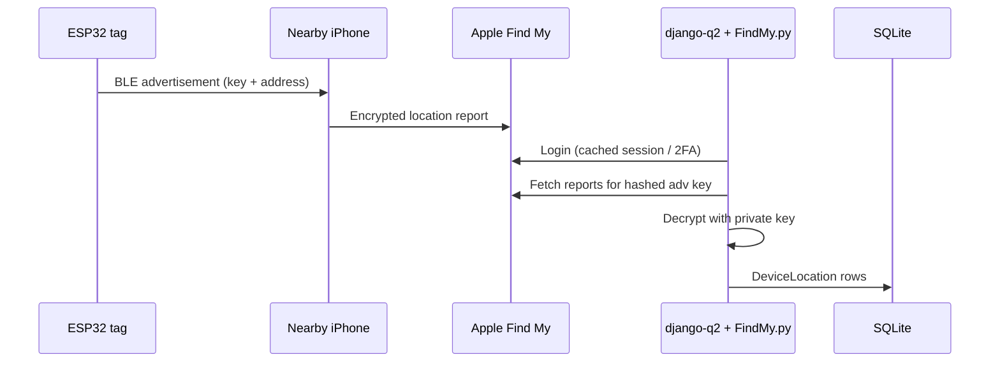
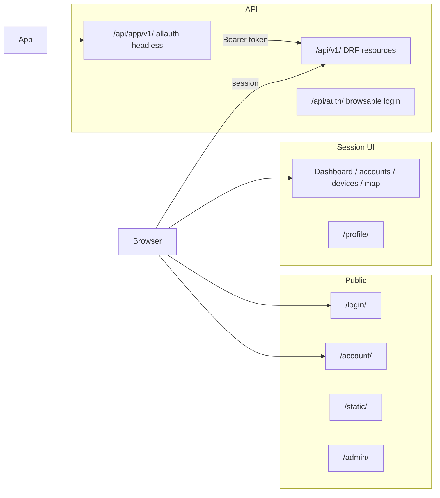
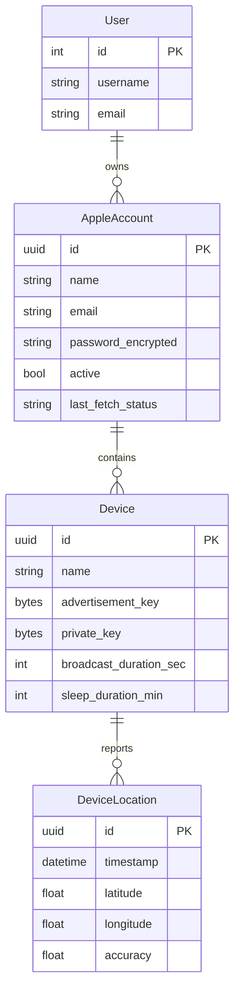
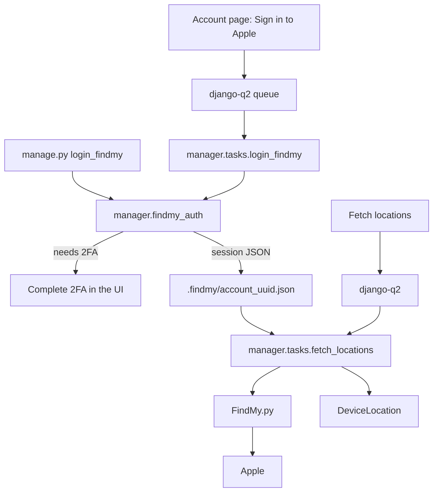

# Building a Find My manager for homemade ESP32 tags

*A walk through what this project actually does — from BLE advertisements on a coin-cell board to a Django desk you can sit at, sign into Apple, and watch a pin appear on a map.*

---

If you have ever wanted an AirTag that you assembled yourself, you already know the gap. Apple’s Find My network is generous: millions of iPhones quietly relay anonymous Bluetooth beacons. The hard part is everything around the beacon — keypairs, firmware that Apple’s network will *recognise*, an Apple ID that can download encrypted reports, a place to decrypt them, and a UI that does not feel like a pile of Python scripts.

This project is that missing desk. It is a Django service that owns the full loop for **ESP32 Find My locator tags**: user accounts, Apple IDs, device keys, firmware exports, background login and location fetch, and a map. It is meant to sit next to a [macless-haystack](https://github.com/dchristl/macless-haystack) container, not replace Apple’s official app.

> Development defaults (`ALLOWED_HOSTS = ["*"]`, console email, an insecure `SECRET_KEY`) are for a **trusted network only**. The database holds Apple credentials and private keys. Treat it as a workshop tool, not a public website.

---

## Contents

1. [The problem, in human terms](#the-problem-in-human-terms)
2. [What the project does](#what-the-project-does)
3. [How Find My DIY actually works](#how-find-my-diy-actually-works)
4. [Architecture](#architecture)
5. [A day in the workshop](#a-day-in-the-workshop)
6. [The data you keep](#the-data-you-keep)
7. [Who can see what](#who-can-see-what)
8. [Firmware: three ways to flash a tag](#firmware-three-ways-to-flash-a-tag)
9. [Talking to Apple without blocking the UI](#talking-to-apple-without-blocking-the-ui)
10. [The REST API](#the-rest-api)
11. [Tools of the stack](#tools-of-the-stack)
12. [Security, honestly](#security-honestly)
13. [Running it](#running-it)
14. [Where the code lives](#where-the-code-lives)
15. [References](#references)

---

## The problem, in human terms

Official AirTags are polished. Homemade tags are a research lineage: [OpenHaystack](https://github.com/seemoo-lab/openhaystack) at TU Darmstadt showed that a cheap BLE radio can impersonate an offline accessory if it broadcasts the right advertisement and the right random static address. Later projects — notably [macless-haystack](https://github.com/dchristl/macless-haystack) — moved the “fetch reports from Apple” side off a Mac and into a Docker box.

What you still end up doing by hand is messy:

- generate a NIST P-224 keypair;
- bake the advertisement key into firmware;
- remember which `.keys` file belongs to which board;
- keep an Apple ID password somewhere;
- complete 2FA when Apple asks;
- paste coordinates into a map.

This manager is the filing cabinet and the workbench. You create a user, add the Apple account you already use with macless-haystack, mint or import a device, export firmware that matches that key, sign in to Apple (including 2FA) from the same page, and fetch locations into SQLite so the map can draw them.

Two people can use the same Apple email independently. Every Apple account, device, and location row belongs to a Django user. The API and the HTML UI both refuse to leak another person’s rows.

---

## What the project does

In one sentence: **it manages homemade Find My tags and the Apple accounts used to decrypt their reports.**

In a checklist:

- **Register and sign in** — unique email, mandatory verification, password reset, optional MFA (TOTP, recovery codes, WebAuthn-ready via allauth).
- **Store Apple IDs** — label, email, password encrypted at rest; export a macless-haystack `config.ini`.
- **Store device keypairs** — the 28-byte *advertisement key* the tag broadcasts and the *private key* used to decrypt reports (same scheme as macless-haystack `generate_keys.py`).
- **Export firmware** — MicroPython `main.py`, native ESP-IDF `main.c`, or Arduino `tag.ino`, with beacon timing you can tune.
- **Export the `.keys` file** — so a companion container can decrypt reports the same way the manager does.
- **Log in to Apple** — including SMS or trusted-device 2FA — and **fetch location history** through [FindMy.py](https://github.com/malmeloo/FindMy.py) in [django-q2](https://django-q2.readthedocs.io/) workers.
- **Show the latest pin** on a MapLibre map (OpenFreeMap dark style, OSM-derived tiles).

It does **not** flash the ESP32 for you, run a BLE sniffer, or replace Apple’s official Find My app. The tag still has to be compiled and uploaded with ESP-IDF, Arduino IDE, or `mpremote`. Apple still has to see the advertisement through someone else’s iPhone.

---

## How Find My DIY actually works

Apple’s offline finding network is a privacy-preserving gossip system. A tag does not phone home. It broadcasts a BLE advertisement that *looks* like an AirTag. Nearby iPhones encrypt their location to that tag’s public key and upload the blob to Apple. Later, someone who holds the matching private key can download those blobs and decrypt them.

For a homemade tag, three numbers matter:

| Piece | Size | Where it lives |
| --- | --- | --- |
| Advertisement key | 28 bytes | On the tag (P-224 public **x-coordinate**) |
| Private key | 28 bytes | Only on the manager / macless-haystack — **never** on the tag |
| Hashed advertisement key | SHA-256 of the 28-byte key | Identifier when asking Apple for reports |

Native firmware also sets the BLE **random static address** to the first six bytes of the advertisement key. Apple’s network stitches address + payload back into the original 28-byte key. MicroPython on ESP32 cannot set that address, which is why a MicroPython sketch is a useful experiment and a poor tracker.



Keys are not bound to a particular Apple ID. You fetch with *an* Apple account and decrypt with *that tag’s* private key. That is why the manager stores both sides: credentials for the fetch, keys for the decrypt.

---

## Architecture

The Django project is small on purpose: one settings module, one HTML app, one JSON API.

```
Browser UI  (/login, /accounts, /devices, /map, /profile)
     │
     │  session cookie
     ▼
┌────────────────────────────────────────────────────────────┐
│  config/          Django project (settings, URLs, middleware)│
│  manager/         HTML UI, models, firmware export, tasks    │
│  api/             DRF resources under /api/v1/               │
│  allauth          Browser /account/* + headless /api/app/v1/ │
│  django-q2        Background Apple login + location fetch    │
└───────────────┬─────────────────────────────┬──────────────┘
                │                             │
                ▼                             ▼
         SQLite (db.sqlite3)          .findmy/ session JSON
         users, Apple accounts,        anisette libs + cached
         devices, locations            Apple login state
                │
                ▼
         FindMy.py  ──►  Apple Find My network
```

### How a request is routed



`ManagerLoginRequiredMiddleware` requires a Django session for almost everything. It leaves `/account/`, `/api/`, `/admin/`, `/static/`, and `/favicon.ico` alone. `/login/` is reachable as `LOGIN_URL`. The API then applies its own authentication (session or Bearer token).

| Prefix | Audience | Auth |
| --- | --- | --- |
| `/` | Manager UI | Django session |
| `/account/` | allauth browser pages | Public for signup / login / reset; session for manage |
| `/api/app/v1/` | allauth headless JSON | Session token during the auth flow |
| `/api/v1/` | DRF resources | Session **or** `Authorization: Bearer <token>` |
| `/api/auth/` | Browsable API login | Django session |
| `/admin/` | Django admin | Staff |
| `/static/` | CSS, Bootstrap, MapLibre | Public |

### The Django apps

| App | Role |
| --- | --- |
| `config` | Settings, root URLs, login-required middleware |
| `manager` | Models, templates, firmware generators, Find My login and fetch |
| `api` | Authenticated JSON API scoped to the current user |
| `allauth` | Signup, email verification, password reset, MFA, headless API |
| `django_q` | ORM-backed worker (`qcluster`) — no Redis required |

---

## A day in the workshop

Imagine you just soldered an ESP32-S3 onto a battery holder.

1. **Create a manager user** at `/account/signup/` (or the sign-up link on `/login/`). Email is required and unique. In development the verification mail is printed to the **console**. Open the link; you are signed in.
2. **Sign in later** with username **or** email. Forgot password lives at `/account/password/reset/`. Profile (`/profile/`) is where you change email, password, and MFA.
3. **Add an Apple account** — the same Apple ID you would put in macless-haystack. The password is encrypted before it hits SQLite.
4. **Sign in to Apple** on that account page. The UI queues `manager.tasks.login_findmy` (the same code as `manage.py login_findmy`). Keep `python manage.py qcluster` running. If Apple wants 2FA, finish SMS or trusted-device on the next page. The session is written to `.findmy/account_<uuid>.json`.
5. **Create a device** — generate a fresh P-224 pair, or paste keys from macless-haystack `generate_keys.py`. Set how many seconds to advertise and how many minutes to rest.
6. **Export firmware** — ESP-IDF if you want Apple to actually see the tag; Arduino if that is your IDE; MicroPython if you are poking at the advertisement format.
7. **Copy the `.keys` lines** (or download the file) into the macless-haystack volume if you still run that container. Download `config.ini` from the account page.
8. **Flash the board**, walk around, wait for iPhones.
9. **Fetch locations** — one account or “Fetch all” on the dashboard. Status (`ok`, `logging_in`, `needs_2fa`, `throttled`, `error`) shows on the dashboard. Open **Map**.

Account and device pages keep **Edit / Map / Delete** on one row and the operational buttons (Apple sign-in, fetch, exports) on another. The navbar hides operations until you are signed in; the username is a dropdown with Profile and Sign out.

You can still do the Apple login in a terminal:

```bash
python manage.py login_findmy "Home"
```

`Home` is the account name or the Apple email. Interactive 2FA, same session file as the UI.

---

## The data you keep

Manager tables use **UUID primary keys**. Django’s `User` stays on the default integer PK.

```
User  1──*  AppleAccount  1──*  Device  1──*  DeviceLocation
```



- **AppleAccount** — friendly name, Apple ID email (unique *per user*), encrypted password, active flag, last fetch status and message, notes.
- **Device** — name, encrypted keys, beacon timing, active flag.
- **DeviceLocation** — timestamp, lat/lon, accuracy, status/battery; unique on `(device, timestamp)`.

QuerySets expose `.for_user(user)` so views and serializers never invent a “show everything” shortcut.

On disk, next to the database:

| Path | What it is |
| --- | --- |
| `db.sqlite3` | Users, accounts, devices, locations, django-q2 jobs, allauth / token tables |
| `.findmy/account_<uuid>.json` | Cached Apple login (plaintext tokens — keep the directory private) |
| `.findmy/ani_libs.bin` | Local anisette libraries when you are not using a remote server |
| `.findmy/*.pending.json` | In-flight 2FA state for the UI login flow |

---

## Who can see what

Signup is allauth: email + username + two passwords. Verification is mandatory (`ACCOUNT_EMAIL_VERIFICATION = "mandatory"`). Confirmation links work with GET; after confirm you are logged in.

`createsuperuser` still works for `/admin/`. Users created that way, without an allauth `EmailAddress`, can sign in on `/login/` with username. Users who registered through allauth must verify email first.

The headless **app** client at `/api/app/v1/` is the same product for a phone or a script: JSON login, signup, logout, email verify, password reset, MFA. After a successful flow, `api.auth.DrfTokenStrategy` issues a Django REST Framework token:

```json
{
  "meta": {
    "is_authenticated": true,
    "access_token": "<drf-token>",
    "token_type": "Bearer",
    "session_token": "<django-session-key>"
  }
}
```

Send `Authorization: Bearer <access_token>` to `/api/v1/...`. `HEADLESS_SERVE_SPECIFICATION = True` publishes an OpenAPI-style description next to those routes.

---

## Firmware: three ways to flash a tag

The manager does not compile C. It **emits source** with your advertisement key and timing baked in.

### MicroPython (`main.py`)

A small loop: build Apple’s offline advertisement, broadcast, deep-sleep. Cadence follows the device’s broadcast / sleep fields. The payload looks like:

`020106 21 ff 4c00 1219 00 <key[:22]> <key[22:28]> 00`

Because MicroPython cannot set the BLE random static address, Apple’s network often will not stitch the key back together. Use this to learn; use native firmware to track.

### ESP-IDF (`main.c`)

Bluedroid firmware:

- `esp_ble_gap_set_rand_addr()` → address = `key[0:6]`
- 31-byte OpenHaystack payload: `1eff 4c00 1219 00 | key[6:28] | key[0]>>6 | 00`

Those two fragments are how a real tag is recognised.

```bash
python manage.py export_firmware car -o main.c --broadcast 10 --sleep 5
idf.py set-target esp32s3 && idf.py build && idf.py -p PORT flash monitor
```

The sketch advertises, then rests with the radio on. Long sleeps cut average current; a true coin-cell design still wants deep sleep.

### Arduino (`tag.ino`)

Same address + payload, using the BLE API the **ESP32 Arduino core** exposes from ESP-IDF:

```bash
python manage.py export_arduino car -o tag.ino --broadcast 10 --sleep 5
```

Open in the Arduino IDE, pick the board, Upload. If `btStart() failed`, check the board package, the USB cable, and upload speed.

Management commands accept a **device UUID or unique name**, and an **account name or Apple email**.

---

## Talking to Apple without blocking the UI

Apple login is slow, flaky, and sometimes interactive. The manager never does it inside a request/response if it can help it.



Shared module: `manager/findmy_auth.py` — password from the encrypted field, retries on HTTP 5xx, session cache, pending 2FA files. UI and `manage.py login_findmy` call the same functions.

Fetch builds FindMy.py `FixedRollingKeyPairAccessory` objects from each device’s private key, asks Apple for reports, and upserts `DeviceLocation` rows.

Apple 503s are treated as throttling: wait; hammering extends the block. Optional remote anisette: set `FINDMY_ANISETTE_URL` (for example `http://anisette:6969`). Empty means the bundled local provider and `.findmy/ani_libs.bin`.

One-off fetch without the worker:

```bash
python manage.py fetch_locations --all --days 7
```

Periodic:

```bash
python manage.py schedule_fetch --every 15 --unit minutes
```

`Q_CLUSTER` uses the ORM broker and a 600-second timeout so Apple’s thinking time does not look like a dead worker.

---

## The REST API

Everything under `/api/v1/` requires authentication and is scoped to `request.user`. The browsable API uses `/api/auth/login/`.

| Method | Path | Purpose |
| --- | --- | --- |
| CRUD | `/api/v1/accounts/` | Apple accounts |
| GET | `/api/v1/accounts/{id}/config.ini/` | macless `config.ini` payload |
| POST | `/api/v1/accounts/{id}/fetch/` | Queue fetch for one account |
| CRUD | `/api/v1/devices/` | Devices |
| GET | `/api/v1/devices/{id}/keys/` | Advertisement + private key hex |
| GET | `/api/v1/devices/{id}/export/micropython/` | `main.py` |
| GET | `/api/v1/devices/{id}/export/firmware/` | ESP-IDF `main.c` |
| GET | `/api/v1/devices/{id}/export/arduino/` | `tag.ino` |
| GET | `/api/v1/locations/` | Stored reports |
| GET | `/api/v1/map/` | Latest marker per active device |
| GET | `/api/v1/keys/` | Combined `.keys` file |
| POST | `/api/v1/fetch/` | Queue fetch for every account with a password |

django-filter, search, and ordering are enabled on the viewsets (accounts by `active` / name / email; devices by account, active, name).

---

## Tools of the stack

Each of these is a deliberate choice, not a grab-bag. Here is what it is, why it is here, and where to read more.

### Django

**Resume.** Django is a batteries-included Python web framework: ORM, admin, auth, templates, migrations, management commands.

**In this project.** The whole service *is* a Django 5 project (`config` + `manager` + `api`). Models, UUID PKs, encrypted fields, session login, `manage.py` exporters, and tests all sit on that spine.

- Repository: [github.com/django/django](https://github.com/django/django)
- Docs: [docs.djangoproject.com](https://docs.djangoproject.com/)
- Site: [djangoproject.com](https://www.djangoproject.com/)

### Django REST Framework

**Resume.** DRF turns Django models into HTTP resources: serializers, viewsets, browsable API, pagination, token auth.

**In this project.** `/api/v1/` is a set of viewsets. Authentication is session (for the browsable UI) plus `DrfBearerTokenAuthentication`, which accepts `Authorization: Bearer ...` so allauth’s headless `token_type` matches.

- Repository: [github.com/encode/django-rest-framework](https://github.com/encode/django-rest-framework)
- Docs: [django-rest-framework.org](https://www.django-rest-framework.org/)

### django-filter

**Resume.** Declarative query-parameter filters for Django and DRF (`?active=true`).

**In this project.** Wired as `DEFAULT_FILTER_BACKENDS` next to DRF search and ordering, so list endpoints stay usable from a script.

- Repository: [github.com/carltongibson/django-filter](https://github.com/carltongibson/django-filter)
- Docs: [django-filter.readthedocs.io](https://django-filter.readthedocs.io/)

### django-allauth

**Resume.** The standard Django package for signup, email verification, password reset, social login, MFA, and — more recently — a **headless** JSON API for native apps.

**In this project.** Browser pages live under `/account/` (`HEADLESS_ONLY = False`). MFA extras (`[mfa,webauthn]`) enable TOTP, recovery codes, and passkeys when you turn them on. The headless **app** client is `/api/app/v1/`. After login, `HEADLESS_TOKEN_STRATEGY = api.auth.DrfTokenStrategy` mints a `rest_framework.authtoken` token. Email is unique and verification is mandatory; login methods are username **or** email.

- Repository: [github.com/pennersr/django-allauth](https://github.com/pennersr/django-allauth)
- Docs: [docs.allauth.org](https://docs.allauth.org/)
- Headless: [docs.allauth.org/en/latest/headless](https://docs.allauth.org/en/latest/headless/index.html)

### django-bootstrap5

**Resume.** Template tags that render Django forms and messages with Bootstrap 5 markup.

**In this project.** ``, ``, and `` keep the dark manager UI and the login page from becoming a pile of hand-written `form-control` classes. Checkboxes render as switches (`BOOTSTRAP5["checkbox_style"]`).

- Repository: [github.com/zostera/django-bootstrap5](https://github.com/zostera/django-bootstrap5)
- Docs: [django-bootstrap5.readthedocs.io](https://django-bootstrap5.readthedocs.io/)

### Bootstrap 5 and Bootstrap Icons

**Resume.** Bootstrap is a CSS/JS toolkit for layout, components, and utilities. Bootstrap Icons is its companion icon font.

**In this project.** Vendored under `manager/static/manager/vendor/bootstrap/` and `bootstrap-icons/`. The chrome is a dark workshop: navbar, cards, dropdowns, dismissible alerts. No CDN at runtime for those files.

- Repository: [github.com/twbs/bootstrap](https://github.com/twbs/bootstrap) · [github.com/twbs/icons](https://github.com/twbs/icons)
- Docs: [getbootstrap.com/docs/5.3](https://getbootstrap.com/docs/5.3/) · [icons.getbootstrap.com](https://icons.getbootstrap.com/)

### cryptography (Fernet)

**Resume.** `cryptography` is the modern Python crypto library. Fernet is a high-level recipe: AES-128-CBC + HMAC (or equivalently “authenticated encryption you should not invent yourself”), URL-safe tokens.

**In this project.** `manager/encryption.py` derives a Fernet key from `SECRET_KEY` (SHA-256, then urlsafe base64). Apple passwords and device keys are stored as `crypt:...`. `EncryptedCharField` encrypts on write and decrypts on read. Changing `SECRET_KEY` invalidates every secret in the database.

- Repository: [github.com/pyca/cryptography](https://github.com/pyca/cryptography)
- Docs: [cryptography.io](https://cryptography.io/) · [Fernet](https://cryptography.io/en/latest/fernet/)

### django-q2

**Resume.** A Django task queue with optional Redis, or — as used here — an **ORM broker** so a second process (`qcluster`) can run jobs from the same SQLite file.

**In this project.** Apple login and location fetch are `async_task("manager.tasks....")`. Timeouts are long (600s) because Apple is not a microservice. `schedule_fetch` installs a repeating job. You need `qcluster` running for the UI buttons to do anything useful.

- Repository: [github.com/django-q2/django-q2](https://github.com/django-q2/django-q2)
- Docs: [django-q2.readthedocs.io](https://django-q2.readthedocs.io/)

### FindMy.py (`findmy` on PyPI)

**Resume.** A Python library that logs into Apple, speaks anisette, fetches Find My reports, and decrypts them. It exists so you do not have to stitch together a dozen half-documented gists.

**In this project.** `manager/tasks.py` and `manager/findmy_auth.py` use `AppleAccount`, `LocalAnisetteProvider` / `RemoteAnisetteProvider`, and `FixedRollingKeyPairAccessory`. This is the only component that talks to Apple.

- Repository: [github.com/malmeloo/FindMy.py](https://github.com/malmeloo/FindMy.py)
- Docs: [docs.mikealmel.ooo/FindMy.py](https://docs.mikealmel.ooo/FindMy.py/)
- PyPI: [pypi.org/project/findmy](https://pypi.org/project/findmy/)

### macless-haystack

**Resume.** A Docker-oriented reimplementation of the OpenHaystack *backend*: fetch reports without a Mac, using anisette in a container and a web UI.

**In this project.** The manager is a companion, not a fork. It exports `config.ini` (`appleid` / `appleid_pass`) and `.keys` lines in the format that container expects. You can run both: container for 24/7 fetching, manager for keys, firmware, and a map you control.

- Repository: [github.com/dchristl/macless-haystack](https://github.com/dchristl/macless-haystack)

### OpenHaystack

**Resume.** The academic project that documented homemade Find My accessories: firmware, key format, and the idea of using Apple’s network with your own P-224 keys.

**In this project.** The ESP-IDF / Arduino advertisement layout is the OpenHaystack payload. Understanding “address + payload = 28-byte key” is the difference between a blinking board and a pin on the map.

- Repository: [github.com/seemoo-lab/openhaystack](https://github.com/seemoo-lab/openhaystack)
- Paper / project: [seemoo.de — OpenHaystack](https://www.seemoo.de/en/2021/12/16/openhaystack/)

### MicroPython

**Resume.** Python 3 for microcontrollers. On ESP32 it can advertise BLE, deep-sleep, and be updated over USB without a C toolchain.

**In this project.** `manager` generates a `main.py` with the advertisement key as a `bytes([...])` literal. Honest limitation: no random static address, so real-world matching is weak.

- Repository: [github.com/micropython/micropython](https://github.com/micropython/micropython)
- Docs: [docs.micropython.org](https://docs.micropython.org/)
- ESP32 port: [docs.micropython.org/en/latest/esp32](https://docs.micropython.org/en/latest/esp32/quickref.html)

### ESP-IDF

**Resume.** Espressif’s official IoT framework: FreeRTOS, Bluedroid/NimBLE, `idf.py` build and flash.

**In this project.** Generated `main.c` calls `esp_ble_gap_set_rand_addr` and builds the manufacturer-specific Find My payload. This is the path that matches Apple’s network.

- Repository: [github.com/espressif/esp-idf](https://github.com/espressif/esp-idf)
- Docs: [docs.espressif.com/projects/esp-idf](https://docs.espressif.com/projects/esp-idf/en/latest/)

### Arduino (ESP32 core)

**Resume.** The Arduino IDE plus Espressif’s Arduino-ESP32 core: sketches (`.ino`), board manager, the same IDF BLE APIs underneath.

**In this project.** Generated `tag.ino` is for people who already live in that IDE. Behaviour matches the IDF export.

- Repository: [github.com/espressif/arduino-esp32](https://github.com/espressif/arduino-esp32)
- Docs: [docs.espressif.com/projects/arduino-esp32](https://docs.espressif.com/projects/arduino-esp32/en/latest/)
- Arduino IDE: [github.com/arduino/arduino-ide](https://github.com/arduino/arduino-ide)

### MapLibre GL JS

**Resume.** An open-source fork of Mapbox GL JS: vector maps in the browser, no Mapbox token required.

**In this project.** Vendored as `manager/static/manager/vendor/maplibre/`. The map page drops one marker per active device (latest location). Navigation control, no compass.

- Repository: [github.com/maplibre/maplibre-gl-js](https://github.com/maplibre/maplibre-gl-js)
- Docs: [maplibre.org/maplibre-gl-js/docs](https://maplibre.org/maplibre-gl-js/docs/)

### OpenFreeMap and OpenStreetMap

**Resume.** OpenStreetMap is the collaborative map of the world. OpenFreeMap serves OSM-derived vector styles you can point MapLibre at without running your own tile stack.

**In this project.** The dark style URL is `https://tiles.openfreemap.org/styles/dark`. Attribution still belongs to OSM contributors.

- OpenFreeMap: [openfreemap.org](https://openfreemap.org/) · [github.com/hyperknot/openfreemap](https://github.com/hyperknot/openfreemap)
- OpenStreetMap: [openstreetmap.org](https://www.openstreetmap.org/) · [wiki.openstreetmap.org](https://wiki.openstreetmap.org/)

### SQLite

**Resume.** A serverless SQL database in a file. Perfect for a single-host workshop app.

**In this project.** Default `DATABASES` engine. Users, manager tables, django-q2, allauth, and DRF tokens all live in `db.sqlite3`. That is why `qcluster` can share work with `runserver` without Redis.

- Site: [sqlite.org](https://www.sqlite.org/)
- Docs: [sqlite.org/docs.html](https://www.sqlite.org/docs.html)

### Anisette (local or remote)

**Resume.** Apple’s auth stack expects “anisette” device-provisioning data — historically produced by a real Apple device or by a sidecar such as [anisette-v3-server](https://github.com/Dadoum/anisette-v3-server). FindMy.py can host a **local** provider (download libraries to `ani_libs.bin`) or call a **remote** URL.

**In this project.** `FINDMY_ANISETTE_URL` empty → local. Set it if you already run an anisette container next to macless-haystack.

- FindMy.py anisette docs: [docs.mikealmel.ooo/FindMy.py](https://docs.mikealmel.ooo/FindMy.py/)
- Typical server: [github.com/Dadoum/anisette-v3-server](https://github.com/Dadoum/anisette-v3-server)

---

## Security, honestly

This is a workshop with the safe unlocked. That is a feature when you are copying keys onto a serial console. It is a liability on the public internet.

- Apple passwords and private keys are encrypted at rest (Fernet). The key is Django’s `SECRET_KEY`. Rotate it only if you are ready to re-enter secrets.
- Device pages show keys in plaintext so you can paste them. That is intentional.
- `.findmy/*.json` sessions are reusable Apple login state in plaintext. Restrict directory permissions.
- Users only see their own accounts, devices, and locations. Do not confuse that with “safe to expose”: you still need HTTPS, a real email backend, a secret `SECRET_KEY`, and a reverse proxy before this leaves the LAN.
- Development `ALLOWED_HOSTS = ["*"]` and the console email backend are not production settings.

Using Apple’s network with unofficial clients may violate Apple’s terms. You are responsible for how you use your own Apple ID.

---

## Running it

Django always imports `config.settings`, which means a file named
`config/settings.py` must exist. What lives in the repository is the
template **`config/settings.dist.py`**. On deploy — and on any fresh
checkout — copy it first, then edit the copy:

```bash
cp config/settings.dist.py config/settings.py
```

Set a unique `SECRET_KEY` (it also unlocks Fernet-encrypted Apple passwords
and device keys), restrict `ALLOWED_HOSTS`, turn `DEBUG` off outside a
trusted LAN, and point `EMAIL_BACKEND` at a real mailer if users must
receive verification mail. Leave `settings.dist.py` as the shared default;
keep secrets in the local `settings.py`.

```bash
python -m venv .venv && source .venv/bin/activate
pip install -r requirements.txt
python manage.py migrate
python manage.py runserver
```

Second terminal:

```bash
source .venv/bin/activate
python manage.py qcluster
```

Open http://127.0.0.1:8000/ — register, confirm the console email, add an Apple account, create a device, export firmware, sign in to Apple, fetch, map.

Useful CLI (UUID or name for devices; name or email for accounts):

```bash
python manage.py generate_devices 4 --account "Home" --prefix tag
python manage.py export_micropython car -o main.py --broadcast 10 --sleep 5
python manage.py export_firmware car -o main.c --broadcast 10 --sleep 5
python manage.py export_arduino car -o tag.ino --broadcast 10 --sleep 5
python manage.py login_findmy "Home"
python manage.py fetch_locations --all --days 7
python manage.py schedule_fetch --every 15 --unit minutes
```

Tests:

```bash
python manage.py test manager api
```

`manager` covers keys, exports, ownership, UI, Apple login, and allauth signup/login. `api` covers headless auth and DRF resources.

### Settings worth knowing

Defined on the **local** `config/settings.py` after you copy
`config/settings.dist.py`.

| Setting | Meaning |
| --- | --- |
| `FINDMY_STATE_DIR` | Cached Apple sessions + anisette (default `.findmy/`) |
| `FINDMY_ANISETTE_URL` | Remote anisette; empty = local |
| `Q_CLUSTER` | django-q2, ORM broker, long timeout |
| `ACCOUNT_*` | Signup fields, unique email, verification, login methods |
| `EMAIL_BACKEND` | Console in development |
| `HEADLESS_*` | Headless client + DRF token strategy |
| `SECRET_KEY` | Sessions **and** Fernet material |
| `LOGIN_URL` | `/login/` |

---

## Where the code lives

```
config/                 Django project
  settings.dist.py      Committed settings template — copy on deploy
  settings.py           Local settings Django loads (create from the .dist)
  urls.py               /admin /api /account / (manager)
  middleware.py         Login-required except public prefixes
manager/                UI + domain logic
  models.py             AppleAccount, Device, DeviceLocation
  views.py              Pages, exports, enqueue login/fetch
  findmy_auth.py        Shared Apple login / 2FA / session cache
  tasks.py              django-q2: login_findmy, fetch_locations
  keygen.py / *export*  P-224 keys and firmware generators
  templates/manager/    Bootstrap 5 dark UI
api/                    DRF viewsets + Bearer token strategy
templates/              Admin, DRF, allauth element overrides
```

If the README is the operator’s card, this article is the tour: why the pieces exist, how a beacon becomes a map pin, and which upstream projects you are standing on.

---

## References

### This project

- Operator documentation: [README.md](README.md)
- Python dependencies: [requirements.txt](requirements.txt)

### Web framework and API

- Django — [github.com/django/django](https://github.com/django/django), [docs.djangoproject.com](https://docs.djangoproject.com/)
- Django REST Framework — [github.com/encode/django-rest-framework](https://github.com/encode/django-rest-framework), [django-rest-framework.org](https://www.django-rest-framework.org/)
- django-filter — [github.com/carltongibson/django-filter](https://github.com/carltongibson/django-filter), [django-filter.readthedocs.io](https://django-filter.readthedocs.io/)
- django-allauth — [github.com/pennersr/django-allauth](https://github.com/pennersr/django-allauth), [docs.allauth.org](https://docs.allauth.org/), [headless](https://docs.allauth.org/en/latest/headless/index.html)
- django-q2 — [github.com/django-q2/django-q2](https://github.com/django-q2/django-q2), [django-q2.readthedocs.io](https://django-q2.readthedocs.io/)
- django-bootstrap5 — [github.com/zostera/django-bootstrap5](https://github.com/zostera/django-bootstrap5), [docs](https://django-bootstrap5.readthedocs.io/)

### UI and maps

- Bootstrap — [github.com/twbs/bootstrap](https://github.com/twbs/bootstrap), [getbootstrap.com/docs/5.3](https://getbootstrap.com/docs/5.3/)
- Bootstrap Icons — [github.com/twbs/icons](https://github.com/twbs/icons), [icons.getbootstrap.com](https://icons.getbootstrap.com/)
- MapLibre GL JS — [github.com/maplibre/maplibre-gl-js](https://github.com/maplibre/maplibre-gl-js), [docs](https://maplibre.org/maplibre-gl-js/docs/)
- OpenFreeMap — [openfreemap.org](https://openfreemap.org/), [github.com/hyperknot/openfreemap](https://github.com/hyperknot/openfreemap)
- OpenStreetMap — [openstreetmap.org](https://www.openstreetmap.org/), [wiki](https://wiki.openstreetmap.org/)

### Crypto and data

- cryptography / Fernet — [github.com/pyca/cryptography](https://github.com/pyca/cryptography), [cryptography.io/en/latest/fernet](https://cryptography.io/en/latest/fernet/)
- SQLite — [sqlite.org/docs.html](https://www.sqlite.org/docs.html)
- NIST P-224 — [nvlpubs.nist.gov/nistpubs/FIPS/NIST.FIPS.186-4.pdf](https://nvlpubs.nist.gov/nistpubs/FIPS/NIST.FIPS.186-4.pdf) (ECDSA curves; P-224 is the Find My accessory curve)

### Find My ecosystem

- FindMy.py — [github.com/malmeloo/FindMy.py](https://github.com/malmeloo/FindMy.py), [docs.mikealmel.ooo/FindMy.py](https://docs.mikealmel.ooo/FindMy.py/), [PyPI](https://pypi.org/project/findmy/)
- macless-haystack — [github.com/dchristl/macless-haystack](https://github.com/dchristl/macless-haystack)
- OpenHaystack — [github.com/seemoo-lab/openhaystack](https://github.com/seemoo-lab/openhaystack)
- anisette-v3-server — [github.com/Dadoum/anisette-v3-server](https://github.com/Dadoum/anisette-v3-server)

### Firmware toolchains

- MicroPython — [github.com/micropython/micropython](https://github.com/micropython/micropython), [docs.micropython.org](https://docs.micropython.org/)
- ESP-IDF — [github.com/espressif/esp-idf](https://github.com/espressif/esp-idf), [docs.espressif.com/projects/esp-idf](https://docs.espressif.com/projects/esp-idf/en/latest/)
- Arduino-ESP32 — [github.com/espressif/arduino-esp32](https://github.com/espressif/arduino-esp32), [docs](https://docs.espressif.com/projects/arduino-esp32/en/latest/)
- Bluetooth Core Specification (advertising, random static address) — [bluetooth.com/specifications](https://www.bluetooth.com/specifications/specs/)

### Python packaging used here

Declared in `requirements.txt`: `Django>=5.0`, `djangorestframework>=3.15`, `django-filter>=24.0`, `django-allauth[mfa,webauthn]>=65.0`, `django-bootstrap5>=26.0`, `cryptography>=40.0`, `django-q2>=1.11`, `findmy>=0.10`.
